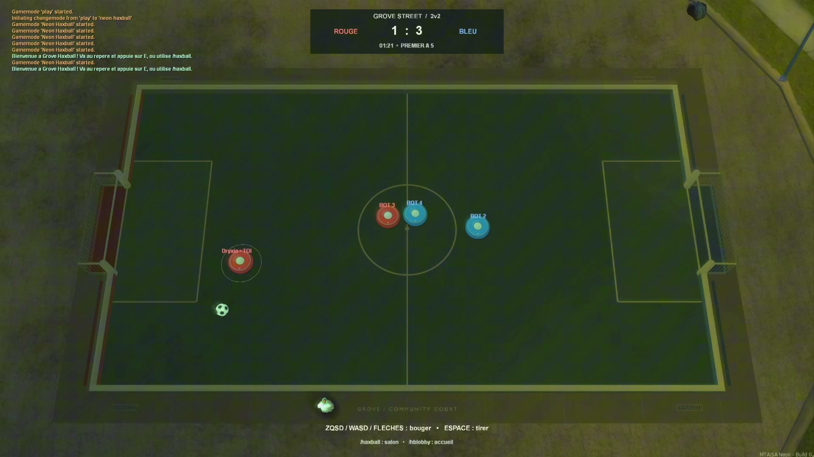

<p align="center">
  <a href="https://mtasa-neon-wiki.vercel.app/neon"></a>
</p>

<p align="center">
  <a href="https://mtasa-neon-wiki.vercel.app/neon"></a>
</p>

<p align="center">
  <a href="https://github.com/Dryxio/mtasa-neon/releases/latest/download/MTA-Neon-Setup.exe"></a>
  <a href="https://github.com/Dryxio/mtasa-neon/releases/latest/download/MTA-Neon-Server-Windows-x64.zip"></a>
</p>

<p align="center"><strong>Players only need the Windows client installer. Server owners should use the separate server package. Both links track the latest explicitly published Neon release.</strong></p>

<p align="center"><strong>New to Neon? Start with the documentation, feature guides, and complete Lua API.</strong></p>

<p align="center">
  <a href="https://discord.com/invite/mgFRd2AzF8"></a>
  <a href="https://github.com/multitheftauto/mtasa-blue"></a>
</p>

<p align="center"><strong>An independent MTA:BLUE-derived playground for deeper GTA:SA engine work.</strong></p>

MTA:SA Neon is an experimental fork of [Multi Theft Auto: San Andreas](https://github.com/multitheftauto/mtasa-blue) that opens up parts of the GTA:SA engine that were never exposed to scripts: a bigger world, higher engine limits, and GTA's own native systems turned into Lua primitives.

Its flagship system brings **GTA:SA's single-player NPCs and traffic into a shared multiplayer world**, running the original AI on one authoritative client.

## See it

Neon renders all of this itself. Nothing to install and no ASI files: every option is a toggle in the settings menu, and servers can drive them too.

**Draw distance**


**Distant lights at night**


**PS2-style color**


Neon also ships its own GTA:SA-inspired menu and server browser, with an optional Discord identity.


## GTA systems, now scriptable

A selection of systems that used to be locked inside the engine. Each clip is a real in-game recording.

| | |
| :--: | :--: |
| [](https://www.youtube.com/watch?v=17QrE21uDgM)<br>**[Native CULL zones](https://mtasa-neon-wiki.vercel.app/neon/rendering-and-limits)**<br>Edit GTA's culling from Lua | [](https://mtasa-neon-wiki.vercel.app/neon/world-objects)<br>**[Dynamic world objects](https://mtasa-neon-wiki.vercel.app/neon/world-objects)**<br>Track, move, damage and break San Andreas' own props |
| [](https://mtasa-neon-wiki.vercel.app/neon/runtime-collision)<br>**[Runtime collision](https://mtasa-neon-wiki.vercel.app/neon/runtime-collision)**<br>Build collision shapes from Lua, no `.col` file | [](https://mtasa-neon-wiki.vercel.app/neon/foliage)<br>**[Custom foliage](https://mtasa-neon-wiki.vercel.app/neon/foliage)**<br>Grow GTA's own vegetation anywhere |
| [](https://mtasa-neon-wiki.vercel.app/neon/fire)<br>**[Managed fire](https://mtasa-neon-wiki.vercel.app/neon/fire)**<br>Synchronized fires that keep their identity and follow a target | [](https://mtasa-neon-wiki.vercel.app/neon/samp-maps)<br>**[SA-MP maps](https://mtasa-neon-wiki.vercel.app/neon/samp-maps)**<br>Load Pawn exports directly, retextured material slots included |
| [](https://mtasa-neon-wiki.vercel.app/neon/birds)<br>**[Scriptable birds](https://mtasa-neon-wiki.vercel.app/neon/birds)**<br>Steerable flocks with their own renderer, past GTA's six slots | [](https://mtasa-neon-wiki.vercel.app/neon/model-2dfx)<br>**[Model 2DFX effects](https://mtasa-neon-wiki.vercel.app/neon/model-2dfx)**<br>Drive the lights baked into GTA models, no custom assets |
| [](https://youtu.be/RCc2HiIRbT4)<br>**[Object fracture](https://mtasa-neon-wiki.vercel.app/neon/break-effects)**<br>Make any object breakable at runtime, no `.dff` editing | [](https://mtasa-neon-wiki.vercel.app/neon/object-physics)<br>**[Object physics](https://mtasa-neon-wiki.vercel.app/neon/object-physics)**<br>Give any object GTA's real rigid-body simulation, synchronized |

<p align="center">
  <a href="https://mtasa-neon-wiki.vercel.app/neon/vehicle-audio"></a><br>
  <strong><a href="https://mtasa-neon-wiki.vercel.app/neon/vehicle-audio">Custom vehicle audio and backfires</a></strong><br>
  Copy an existing Assetto Corsa or Soundize <code>.bank</code>, assign it to a car, and Neon makes it follow the RPM, throttle and gears automatically.<br>
  Other players hear configured cars too, and Lua can trigger a backfire pop with matching exhaust flames.<br>
  <a href="https://mtasa-neon-wiki.vercel.app/neon-media/vehicle-audio-showcase.mp4">Watch the in-game recording with sound</a>
</p>

### More game modes built on Neon

<p align="center">
  <a href="https://www.youtube.com/watch?v=PtjzS45Jl0w"></a><br>
  <strong>Rocket League</strong> · <a href="https://www.youtube.com/watch?v=PtjzS45Jl0w">Watch the video</a>
</p>

<p align="center">
  <a href="docs/media/haxball-demo.mp4"></a><br>
  <strong>HaxBall</strong> · <a href="docs/media/haxball-demo.mp4">Watch clip 1</a> · <a href="docs/media/haxball-demo-2.mp4">Watch clip 2</a>
</p>

```lua
-- Build a wall's collision from a Lua table, then change it live
local col = engineLoadCOL({
    boxes = { { position = { 0, 0, 0 }, size = { 6, 0.5, 2 }, material = 1 } },
})
engineReplaceCOL(col, modelId)

-- Grow GTA's own grass inside a triangle
local patch = createFoliage(v1, v2, v3, 10, 1.5)
patch.density = 2.0

-- Light a synchronized fire, then move it onto a car while it burns
local fire = createFire(x, y, z, { duration = 10000, strength = 1.5 })
setFireTarget(fire, theVehicle)
```

## Play

Download the Windows client installer, run it, and join a server from the Neon browser. Neon checks for newer signed releases on launch and offers them as optional updates.

Server owners use the separate server package. Both downloads are linked at the top of this page.

## What changes versus MTA:SA

| Area | MTA:SA | MTA:SA Neon |
| --- | ---: | ---: |
| Ambient NPCs and traffic | Local only, disabled by MTA | Server-owned peds running GTA's native AI, with one syncer and handoff |
| World size | Approximately -3,000 to +3,000 | -10,000 to +9,999, with matching radar and F11 map |
| GTA corona pool | 64 | 4,096 |
| GTA 3D marker pool | 32 | 4,096 |
| Visible entity pointers | 1,000 | 8,192 |
| Collision authoring | A packaged `.col` file | Generated from a Lua table and rebuildable live |
| Vegetation placement | Whatever the map contains | Resource-owned foliage driving GTA's plant manager |
| Fire | Client-only, returns a boolean, no handle | Synchronized `fire` elements you can retarget and change while burning |
| Ambient birds | Six native slots, no script access | Resource-owned `bird` elements you steer, restyle and shoot; 128 verified at once |
| Model 2DFX effects | Baked into models, not exposed | Read, edit, add and remove them from Lua, with per-resource rollback |
| Breakable objects | Only models shipping the breakable plugin | Any streamed object, fractured from its own geometry |
| Object physics | Static unless scripted frame by frame | Opt-in native rigid-body simulation, with velocities synchronized through syncer changes |
| Ropes | Only the legacy `createSWATRope` call | All eight native rope types as synchronized elements, with cargo attachment and slot leasing |
| Vehicle audio | GTA's sound assigned to each model | Import prepared engine banks from other car projects, assign them to models, and let Neon follow RPM, throttle and gears, with scriptable backfire sounds and exhaust flames |
| Distant lights and draw distance | Not integrated | Built in, 300 to 5,000 units, off by default |

That is the short list. The [full comparison table](https://mtasa-neon-wiki.vercel.app/neon/features) covers every pool, boundary and subsystem.

## For scripters

Neon adds **302 documented Lua functions** on top of MTA's API, plus new elements and events. A few, to give the shape of it:

```lua
engineSetRadarMapTile(column, row, txd)        -- resource-owned extended radar tiles
engineCreateCullZone(...)                      -- native CULL zones from Lua
createFoliage(v1, v2, v3, surface, density)    -- GTA's native vegetation
engineSetCOLData(col, collisionTable)          -- rebuild collision in place
getAmbientPedSpawnCandidate(origin, "cop")     -- ask GTA where a ped belongs
setFireTarget(fire, vehicle)                   -- a burning fire follows an element
createBird(x, y, z, { preset = "desert" })     -- flocks with their own renderer
setModel2DFXProperty(1226, 0, "color", c)      -- recolour every lamp post of a model
createObjectBreakEffect(obj, { force = 4 })    -- fracture any object, no breakable DFF
setObjectDynamicPhysics(ball, true)            -- real GTA physics, synchronized
createRope(x, y, z, { type = "wreckingBall" }) -- GTA's own cranes and winches
enginePlayVehicleAudioBackfire(car, 2)           -- a strong pop and flames from the exhaust
```

The **[Neon Lua API](https://mtasa-neon-wiki.vercel.app/neon/functions)** is the complete reference, with signatures, lifecycle rules, source commits and test evidence for every entry.

## Build gamemodes with AI agents

The **[Neon CLI](https://mtasa-neon-wiki.vercel.app/neon/cli/)** gives an AI coding agent the complete MTA + Neon API and the exact context for your gamemode. The agent can find the right functions, read their arguments and client/server side, check common project mistakes, and verify whether the server, client, and GTA actually joined a test—all locally, without an MCP server.

Start once from your gamemode folder:

```sh
neon init --workspace /path/to/gamemode --profile neon-pair --json
```

Then point the agent to the generated `NEON_AGENT.md` and let it use the CLI while it works. The same portable ZIP supports Windows and macOS with Python 3.10 or newer.

**[Download Neon CLI Portable v1.0.0](https://github.com/Dryxio/mtasa-neon/releases/download/neon-cli-v1.0.0/Neon-CLI-Portable.zip)** · **[Setup and complete agent workflow](https://mtasa-neon-wiki.vercel.app/neon/cli/)**

## Server resources

[Official Neon resources](official-resources/README.md) are ready-to-use server
systems, including synchronized pedestrian and vehicle traffic. The directory
includes installation instructions and links to each resource's scope and controls.

[Test resources](test-resources/README.md) contain development harnesses,
regressions, showcases, and experimental scenarios. Install those selectively
on a development server.

## Documentation

| | |
| --- | --- |
| [Neon wiki](https://mtasa-neon-wiki.vercel.app/neon) | Everything: guides, Lua API, evidence |
| [Synchronized NPCs](https://mtasa-neon-wiki.vercel.app/neon/synchronized-ai) | How shared native AI works |
| [Extended world](https://mtasa-neon-wiki.vercel.app/neon/extended-world) | Boundaries, radar, water, seabed |
| [Neon CLI for AI agents](https://mtasa-neon-wiki.vercel.app/neon/cli/) | Give an agent the complete API, project context, checks, and runtime proof |
| [Tooling and verification](https://mtasa-neon-wiki.vercel.app/neon/tooling-and-verification) | What is actually proven, and what is not |
| [BUILDING.md](./BUILDING.md) | Compiling the client and server |

Deeper technical notes live in [LIMIT_PATCHING.md](./LIMIT_PATCHING.md), [EXTENDED_RADAR.md](./EXTENDED_RADAR.md), [STORY_RUNTIME.md](./STORY_RUNTIME.md), [ENTITY_PERFORMANCE.md](./ENTITY_PERFORMANCE.md) and [MULTI_CLIENT.md](./MULTI_CLIENT.md).

## Upstream relationship

Neon is built on [Multi Theft Auto: San Andreas](https://github.com/multitheftauto/mtasa-blue) and preserves its complete history and GPLv3 licensing. Neon-specific experiments and builds are maintained independently; use the upstream project for official MTA:SA downloads, documentation, and support.

Neon is not affiliated with or endorsed by the Multi Theft Auto team.

## License

Unless otherwise specified, all source code hosted on this repository is licensed under the GPLv3 license. See the [LICENSE](./LICENSE) file for more details.

Grand Theft Auto and all related trademarks are © Rockstar North 1997–2026.
